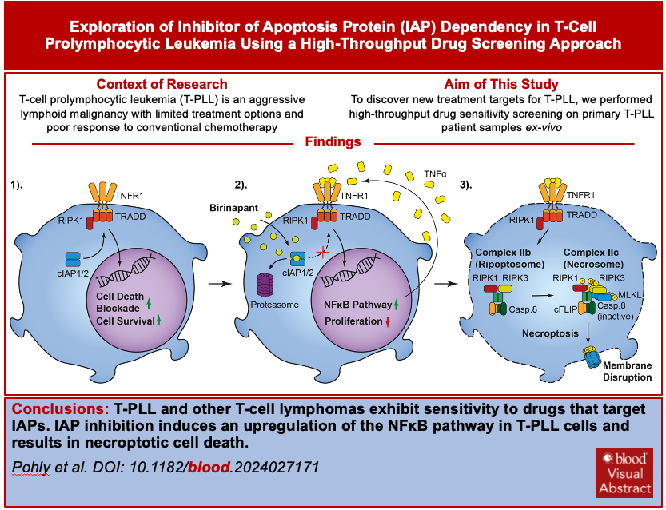

# IAP dependency of T-cell prolymphocytic leukemia identified by high-throughput drug screening.

This Git repository contains the codes for reproducing the bioinformatic analysis results and figures included in the manuscript [IAP dependency of T-cell prolymphocytic leukemia identified by high-throughput drug screening](https://ashpublications.org/blood/article-abstract/doi/10.1182/blood.2024027171/535296/IAP-dependency-of-T-cell-prolymphocytic-leukemia?redirectedFrom=fulltext) by Pohly et al.

- The Rmarkdown (.Rmd) files that contain the source codes are stored in the "analysis" folder.
- The "doc" folder contains the rendered html files from the Rmarkdown files
- The bulk and single-cell RNA-Sequencing data can be downloaded from Zenodo (https://doi.org/10.5281/zenodo.14603672)

